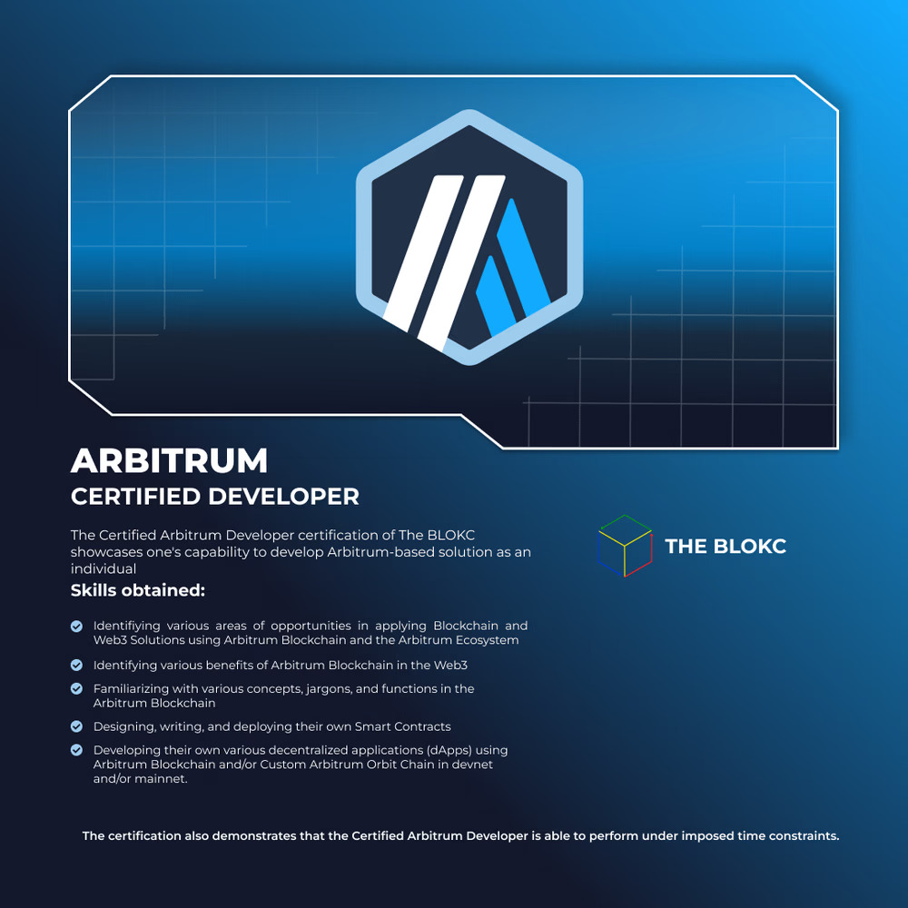

# HevAbi Coin

## Visit the live demo: [HevAbi Coin](https://hevabi.vercel.app)

A bit of context for this project:
This is a bootcamp project that we had back in college. It is a requirement in order to receive a blockchain developer certificate from the bootcamp organizers, The Blokc, which is a blockchain organization here in the Philippines. 

  

I initially couldn't think mof anything as a topic for a project so I just randomized it. Knowing that, I also was an avid listener of Hev Avi, a filipino rapper which is trending that time, and I found the thought of making the webpage and the token all about Hev Abi to be funny. And so I went with it.

Basically, you have to connect a metamask account in order for you to do something. After connecting, you can now mint the token. After minting, you have the option to stake the token and after some time, you can withdraw the toke.

## Features
- **Minting**: Users can mint their own tokens.
- **Staking**: Stake tokens to earn rewards.
- **Withdrawal**: Securely withdraw tokens.

## Technologies Used
- **Languages**: Solidity, JavaScript
- **Frameworks**: Tailwind CSS, Web3.js
- **Tools**: MetaMask, Ganache

[View Repository](https://github.com/CharlesMatthewAtilano/HevAbi)
